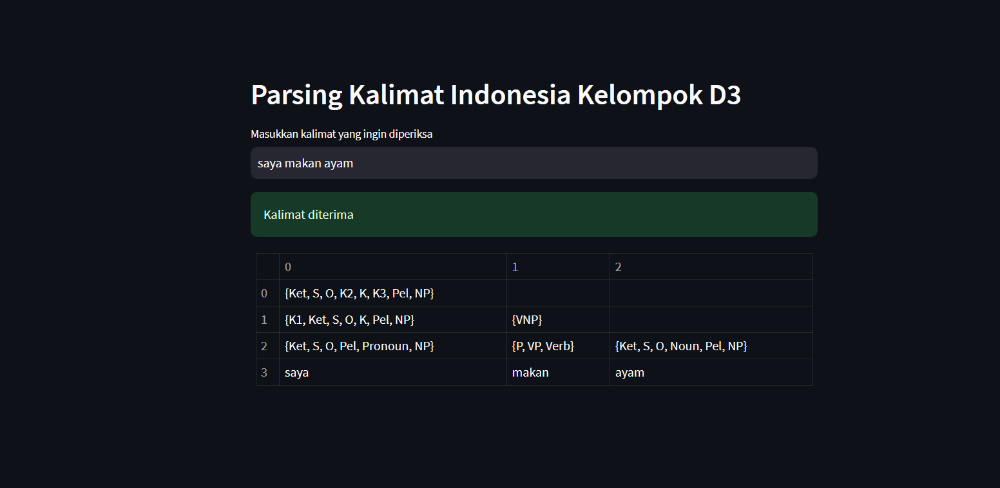

# **Indonesian Language Parsing with CYK Algorithm**

## Website Link
- https://parsingtbod3.streamlit.app/

## About This Project
This app's main objective is to check whether an Indonesian language sentence is in accordance to the rules built by using CYK algorithm to validate the sentence. When a sentence is entered, the app will tell the user whether the sentence is valid and also the table used in for the CYK algorithm. 

## UI
